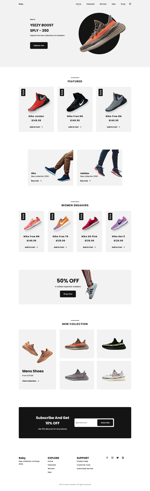

<h1>Roby Sneakers</h1>

<h2>A shoe shop created using HTML, CSS, and JavaScript.</h2>

This website created using HTML, CSS, and JavaScript to show the and close the nav menu, change background header, and link active. I created this following the tutorial of Bedimcode. I added an auto update for the copyright date. Screenshot of the website.

- Live Site: [Roby Sneakers](https://roby-sneakers.netlify.app/)

### Screenshot

